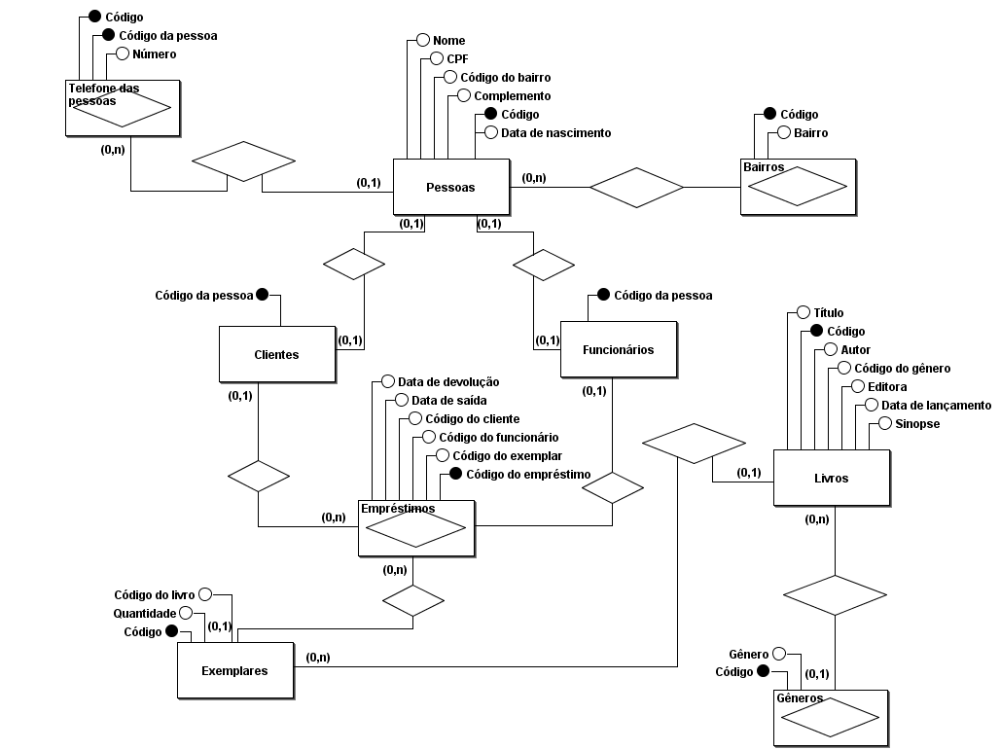

# Library System
LibrarySystem é um projeto com conexão de banco de dados utilizando hibernate para o mapeamento objeto-relacional (ORM).

## Equipe de desenvolvimento
- [Noemy Roberta](https://github.com/noemyroberta/) & [Cleyfane Auanny](https://github.com/cleyfaneauanny/)

## Requisitos para o Sistema
- [X] Ser um sistema de informação;
- [X] Modelo conceitual com ao menos um relacionamento M-N;
- [X] Modelo conceitual com ao menos um relacionamento 1-N;
- [X] Modelo conceitual com ao menos uma hierarquia de herança;
- [X] Utilizar padrão DAO ou mapeamento objeto-relacional (ORM);
- [X] Executar ações de um CRUD.

## Tecnologias Utilizadas

- `Java`: Linguagem de programação utilizada para desenvolver a aplicação.
- `Hibernate`: Framework ORM (Object-Relational Mapping) utilizado para mapear objetos Java para o banco de dados relacional.
- `MySQL`: Banco de dados relacional usado para persistir os dados da aplicação.
- `Hibernate Annotations`: Biblioteca utilizada para adicionar as anotações do Hibernate nas classes de modelo.

## Instalação

### Sistema
- Certifique-se de ter o Java Development Kit (JDK) instalado na máquina.
- Clone o repositório `library-system` para o caminho desejado e execute os próximos passos.

### Banco de Dados com MySQL
- Instale e configure um servidor MySQL na máquina.
- Para criação do banco de dados, execute o script `script-database-creation.sql`, presente no caminho `com.ufal.librarysystem/database`.
- Para inserção de dados, execute o script `script-insertion.sql`, além disso, importe para as tabelas dentro do MySQL Workbench, os arquivos `.csv` presentes no caminho `.../csv-insertion-data`.
  - Insira os arquivos nesta ordem: `tb_livros.csv`>`tb_exemplares.csv`>`tb_emprestimos.csv`.

#### Feito! O banco de dados está criado e pronto para uso.
Para visualização do sistema funcionando, execute a classe `Main.java`, localizada dentro da pasta `com.ufal.librarysystem`.

### Arquitetura do Banco de Dados
#### Modelo Conceitual
Software utilizado para modelagem: `brModelo`

#### Modelo Lógico
Software utilizado para modelagem: `brModelo`

#### Modelo Físico
Software utilizado para modelagem: `MySQL Workbench`

### Execução de consultas
No MySQL Workbench, execute os arquivos:
1. Views: `sript-views-creation.sql`
2. Stored Procedures: `sript-stored-procedures-creation.sql`
3. Chamada de Stored Procedure: `script-call-sp.sql`

